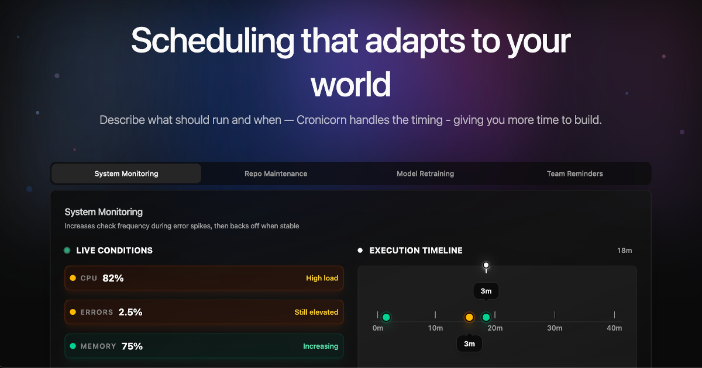

<p align="center">
  
</p>

# Cronicorn
Cronicorn is an **adaptive scheduling engine** for developers and teams.  
You define a job with:
- A plain-English description of what should happen and under what conditions
- One or more endpoints to call when it’s time to run

From there, Cronicorn automatically:
1. Monitors your job’s context — from endpoint responses, system updates, or manual inputs
2. Decides when your endpoints should run
3. Adjusts the schedule dynamically to match real-world conditions

---

## 🛠 Why use it?
- **No more hardcoded schedules** — runs only when it makes sense  
- **Fewer wasted executions** — save time and resources  
- **Set up in minutes** — free tier, no credit card required  
- **Works with your stack** — any service with an HTTP endpoint

---

## 📦 Example Job
```json
{
  "description": "Run health check every 15 minutes unless error rate > 2%",
  "endpoints": [
    {
      "url": "https://api.example.com/status",
      "method": "GET"
    },
    {
      "url": "https://hooks.example.com/alert",
      "method": "POST"
    }
  ]
}
