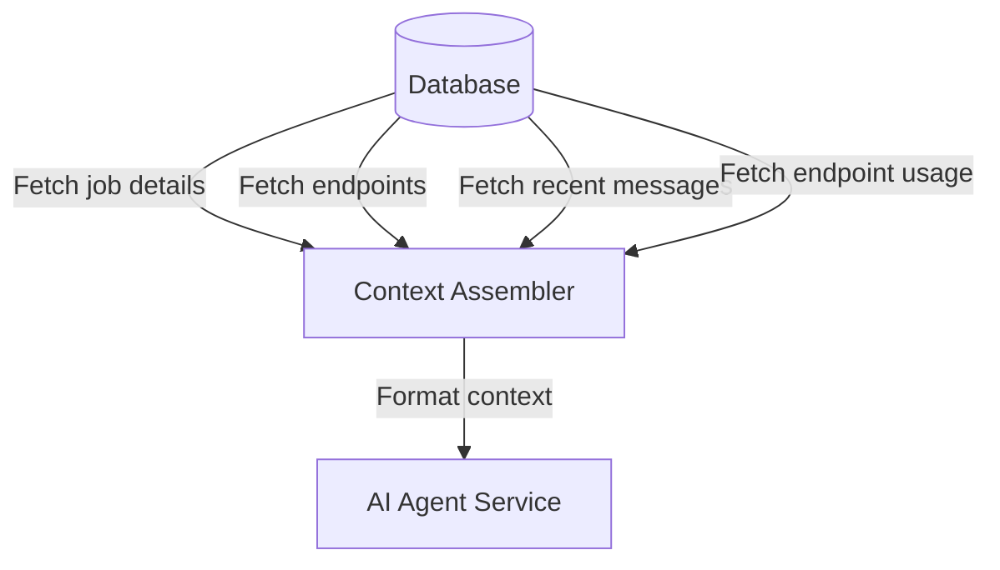
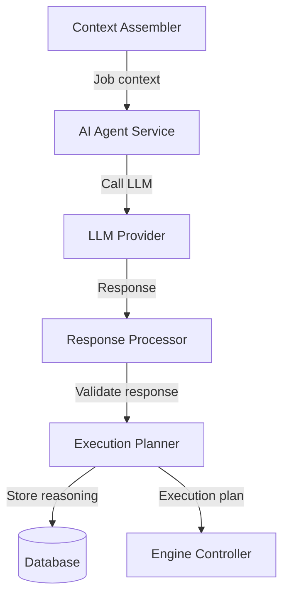
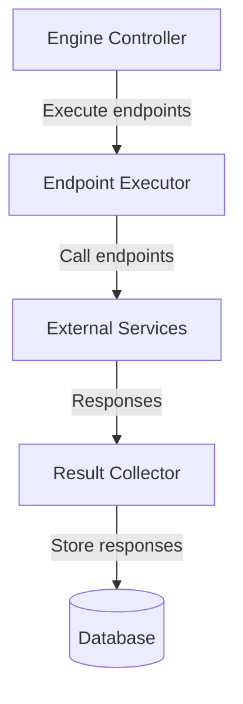
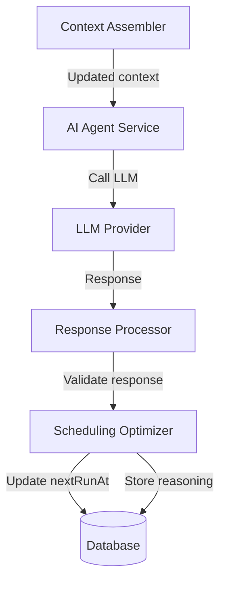

# AI Agent Blueprint for Cronicorn Scheduling Engine

## Introduction

This document provides a comprehensive blueprint for implementing the AI agent component of the Cronicorn scheduling engine. The AI agent is responsible for making intelligent decisions about endpoint execution and scheduling based on job definitions and contextual history.

## Table of Contents

1. [Architecture Overview](#architecture-overview)
2. [Data Flow](#data-flow)
3. [AI Agent Interfaces](#ai-agent-interfaces)
4. [Prompt Engineering](#prompt-engineering)
5. [Error Handling & Resilience](#error-handling--resilience)
6. [Edge Cases & Solutions](#edge-cases--solutions)
7. [End-to-End Examples](#end-to-end-examples)
8. [Production Considerations](#production-considerations)
9. [Deployment Strategy](#deployment-strategy)
10. [Implementation Tasks](#implementation-tasks)

## Architecture Overview

### Core Components

The AI agent system consists of the following components:

1. **AI Agent Service**: Core service that interfaces with the LLM provider
2. **Context Assembler**: Gathers and formats job context for agent consumption
3. **Execution Planner**: Processes agent responses to create execution plans
4. **Response Processor**: Parses and validates agent responses
5. **Scheduling Optimizer**: Final phase for determining optimal next run time

### Workflow Phases

The AI agent operates in two distinct phases:

1. **Execution Planning Phase**:
   - Analyzes job definition and history
   - Determines which endpoints to call and in what order
   - Provides execution parameters and strategy
   - Gives preliminary scheduling estimate

2. **Schedule Optimization Phase**:
   - Analyzes endpoint execution results
   - Makes final determination for next run time
   - Provides recommendations for job management
   - Explains scheduling decision reasoning

### Integration Points

The AI agent integrates with the scheduling engine at these key points:

1. **Job Discovery**: After a job is selected for processing but before endpoints execute
2. **Endpoint Execution**: Before any endpoints are called to determine execution plan
3. **Schedule Setting**: After all endpoints complete to determine next run time
4. **Message Recording**: Creating system messages for reasoning and decisions

## Data Flow

### 1. Initial Context Gathering



### 2. Execution Planning Phase



### 3. Endpoint Execution



### 4. Schedule Optimization Phase



## AI Agent Interfaces

### Context Object Structure

```typescript
interface JobContext {
  job: {
    id: string;
    definitionNL: string;
    status: 'ACTIVE' | 'PAUSED' | 'ARCHIVED';
    nextRunAt?: string; // ISO timestamp
    locked: boolean;
    createdAt: string;
    updatedAt: string;
  };
  
  endpoints: Array<{
    id: string;
    name: string;
    url: string;
    method: string;
    requestSchema?: string; // JSON schema for validation
    bearerToken?: string; // Redacted in prompts for security
    timeoutMs: number;
    fireAndForget: boolean;
    maxRequestSizeBytes?: number;
    maxResponseSizeBytes?: number;
    createdAt: string;
  }>;
  
  messages: Array<{
    id: string;
    role: 'system' | 'user' | 'assistant' | 'tool';
    content: string | MessageContent[];
    timestamp: string;
    source?: string; // Origin of the message
  }>;
  
  endpointUsage: Array<{
    id: string;
    endpointId: string;
    timestamp: string;
    requestSizeBytes?: number;
    responseSizeBytes?: number;
    executionTimeMs: number;
    statusCode?: number;
    success: number; // 1 for success, 0 for failure
    truncated?: number; // 1 if response was truncated
    errorMessage?: string;
  }>;
  
  // Optional runtime context
  executionContext?: {
    currentTime: string; // ISO timestamp of processing time
    systemEnvironment: 'production' | 'development' | 'test';
    resourceConstraints?: {
      maxEndpointConcurrency: number;
      maxExecutionTimeMs: number;
    };
  };
}
```

### Execution Results Object

```typescript
interface ExecutionResults {
  results: Array<{
    endpointId: string;
    success: boolean;
    statusCode?: number;
    responseContent?: any; // Structured content or stringified response
    error?: string;
    executionTimeMs: number;
    timestamp: string; // When execution completed
    requestSizeBytes?: number;
    responseSizeBytes?: number;
    truncated?: boolean; // Whether response was truncated
  }>;
  
  summary: {
    startTime: string; // ISO timestamp
    endTime: string; // ISO timestamp
    totalDurationMs: number;
    successCount: number;
    failureCount: number;
  };
}
```

### AI Agent Service Interface

```typescript
import { generateText } from 'ai';
import { openai } from '@ai-sdk/openai';

interface AIAgentService {
  // Phase 1: Initial planning before endpoint execution
  planExecution(jobContext: JobContext): Promise<AIAgentPlanResponse>;
  
  // Phase 2: Final scheduling after endpoint execution
  finalizeSchedule(
    jobContext: JobContext, 
    executionResults: ExecutionResults
  ): Promise<AIAgentScheduleResponse>;
}
```

### Planning Phase Response

```typescript
interface AIAgentPlanResponse {
  endpointsToCall: Array<{
    endpointId: string;
    parameters?: Record<string, any>; // Request body or query parameters
    headers?: Record<string, string>; // Additional headers to send
    priority: number; // Lower number = higher priority (1 is highest)
    dependsOn?: string[]; // IDs of endpoints that must complete first
    critical: boolean; // Whether failure should stop further execution
  }>;
  
  executionStrategy: 'sequential' | 'parallel' | 'mixed';
  concurrencyLimit?: number; // Max number of parallel executions
  
  preliminaryNextRunAt?: string; // ISO timestamp, initial estimate
  
  reasoning: string; // Detailed explanation of decisions
  confidence: number; // 0.0 to 1.0, confidence in the plan
}
```

### Scheduling Phase Response

```typescript
interface AIAgentScheduleResponse {
  nextRunAt: string; // ISO timestamp for next execution
  
  reasoning: string; // Detailed explanation of scheduling decision
  confidence: number; // 0.0 to 1.0, confidence in the decision
  
  recommendedActions?: Array<{
    type: 'retry_failed_endpoints' | 'pause_job' | 'modify_frequency' | 'notify_user' | 'adjust_timeout';
    details: string; // Explanation of the recommendation
    priority: 'low' | 'medium' | 'high'; // Urgency of the action
  }>;
}
```

## Prompt Engineering

### Planning Phase Implementation with Vercel AI SDK

```typescript
import { generateText } from 'ai';
import { openai } from '@ai-sdk/openai';
import { z } from 'zod';

// Define the schema for execution plan validation
const executionPlanSchema = z.object({
  endpointsToCall: z.array(
    z.object({
      endpointId: z.string(),
      parameters: z.record(z.unknown()).optional(),
      headers: z.record(z.string()).optional(),
      priority: z.number(),
      dependsOn: z.array(z.string()).optional(),
      critical: z.boolean(),
    })
  ),
  executionStrategy: z.enum(['sequential', 'parallel', 'mixed']),
  concurrencyLimit: z.number().optional(),
  preliminaryNextRunAt: z.string().optional(),
  reasoning: z.string(),
  confidence: z.number().min(0).max(1),
});

/**
 * Planning phase implementation using Vercel AI SDK
 */
async function generateExecutionPlan(jobContext: JobContext): Promise<AIAgentPlanResponse> {
  // Format prompts for execution planning
  const systemPrompt = `You are the Cronicorn Scheduling Agent, an intelligent system responsible for planning and optimizing job executions. Your task is to analyze job definitions and determine the optimal execution strategy.`;
  
  // Format the user prompt with all required context
  const userPrompt = `
# Current Time
${jobContext.executionContext?.currentTime}

# Job Definition
${jobContext.job.definitionNL}

# Available Endpoints
${formatEndpoints(jobContext.endpoints)}

# Recent History
${formatMessages(jobContext.messages, 10)}

# Endpoint Usage History
${formatEndpointUsage(jobContext.endpointUsage, 5)}

# Instructions
Analyze the job definition and history to create an execution plan:

1. Determine which endpoints to call based on the job definition and context
2. Specify parameters and headers for each endpoint call
3. Set execution priority (order) and identify dependencies between endpoints
4. Choose between sequential, parallel, or mixed execution strategy
5. Provide a preliminary estimate for the next run time

# Important Constraints
- You MUST only include valid endpoint IDs from the provided list
- Parameters must conform to any provided requestSchema
- If no endpoints need to be called, return an empty array for endpointsToCall
- Provide detailed reasoning explaining your decisions
`;
  
  // Call the AI model using Vercel AI SDK
  const result = await generateText({
    model: openai('gpt-4o'),
    system: systemPrompt,
    prompt: userPrompt,
    temperature: 0.2,
    maxRetries: 2,
    // Use experimental_output for structured response
    experimental_output: {
      schema: executionPlanSchema,
    },
    // Optional: Track token usage
    onStepFinish: (stepResult) => {
      trackTokenUsage(jobContext.job.id, stepResult.usage);
    },
  });
  
  // Return the validated plan
  return result.experimental_output as unknown as AIAgentPlanResponse;
}

// Helper functions for formatting context
function formatEndpoints(endpoints: Endpoint[]): string {
  return endpoints.map(e => {
    const schema = e.requestSchema ? `\nSchema: ${e.requestSchema}` : '';
    return `- ID: ${e.id}\n  Name: ${e.name}\n  URL: ${e.url}\n  Method: ${e.method}${schema}\n  Timeout: ${e.timeoutMs}ms`;
  }).join('\n\n');
}

function formatMessages(messages: Message[], limit: number): string {
  return messages.slice(-limit).map(m => {
    const timestamp = new Date(m.timestamp).toISOString();
    return `[${m.role}] ${timestamp}\n${typeof m.content === 'string' ? m.content : JSON.stringify(m.content)}`;
  }).join('\n\n');
}

function formatEndpointUsage(usage: EndpointUsage[], limit: number): string {
  return usage.slice(-limit).map(u => {
    const status = u.success ? 'SUCCESS' : 'FAILURE';
    const timestamp = new Date(u.timestamp).toISOString();
    const error = u.errorMessage ? `\n  Error: ${u.errorMessage}` : '';
    
    return `- ${u.endpointId} (${timestamp})\n  Status: ${status} (${u.statusCode})\n  Duration: ${u.executionTimeMs}ms${error}`;
  }).join('\n\n');
}

// Token usage tracking
async function trackTokenUsage(
  jobId: string,
  usage?: { inputTokens?: number; outputTokens?: number; totalTokens?: number }
): Promise<void> {
  if (!usage) return;
  
  await db.insert(tokenUsage).values({
    id: crypto.randomUUID(),
    jobId,
    inputTokens: usage.inputTokens ?? 0,
    outputTokens: usage.outputTokens ?? 0,
    totalTokens: usage.totalTokens ?? 0,
    timestamp: new Date().toISOString(),
  });
}
```

### Planning Phase Prompt Template

```
# System Instructions
You are the Cronicorn Scheduling Agent, an intelligent system responsible for planning and optimizing job executions. Your task is to analyze job definitions and determine the optimal execution strategy.

# Current Time
${currentTime}

# Job Definition
${job.definitionNL}

# Available Endpoints
${formatEndpoints(job.endpoints)}

# Recent History
${formatMessages(messages, 10)}

# Endpoint Usage History
${formatEndpointUsage(endpointUsage, 5)}

# Instructions
Analyze the job definition and history to create an execution plan:

1. Determine which endpoints to call based on the job definition and context
2. Specify parameters and headers for each endpoint call
3. Set execution priority (order) and identify dependencies between endpoints
4. Choose between sequential, parallel, or mixed execution strategy
5. Provide a preliminary estimate for the next run time

Your response must follow this JSON format exactly:
{
  "endpointsToCall": [
    {
      "endpointId": "endpoint-uuid",
      "parameters": {
        "key1": "value1",
        "key2": "value2"
      },
      "headers": {
        "Custom-Header": "value"
      },
      "priority": 1,
      "dependsOn": ["endpoint-uuid-2"],
      "critical": true
    }
  ],
  "executionStrategy": "sequential|parallel|mixed",
  "concurrencyLimit": 3,
  "preliminaryNextRunAt": "ISO-8601 timestamp",
  "reasoning": "Detailed explanation of your decision process",
  "confidence": 0.95
}

# Important Constraints
- You MUST only include valid endpoint IDs from the provided list
- You MUST follow the exact JSON structure shown above
- Parameters must conform to any provided requestSchema
- If no endpoints need to be called, return an empty array for endpointsToCall
- Provide detailed reasoning explaining your decisions
```

### Scheduling Phase Prompt Template

```
# System Instructions
You are the Cronicorn Scheduling Agent, an intelligent system responsible for planning and optimizing job executions. Your task now is to determine the optimal next run time based on execution results.

# Current Time
${currentTime}

# Job Definition
${job.definitionNL}

# Previous Execution Plan
${formatExecutionPlan(previousPlan)}

# Execution Results
${formatExecutionResults(executionResults)}

# Recent Message History
${formatMessages(messages, 5)}

# Instructions
Based on the job definition and execution results, determine the optimal time for the next execution:

1. Analyze the endpoint responses for timing signals or patterns
2. Consider the job's natural language definition for timing requirements
3. Determine the most appropriate next execution time
4. Provide detailed reasoning for your scheduling decision
5. Recommend any additional actions if necessary

Your response must follow this JSON format exactly:
{
  "nextRunAt": "ISO-8601 timestamp",
  "reasoning": "Detailed explanation of your scheduling decision",
  "confidence": 0.95,
  "recommendedActions": [
    {
      "type": "retry_failed_endpoints|pause_job|modify_frequency|notify_user|adjust_timeout",
      "details": "Explanation of the recommended action",
      "priority": "low|medium|high"
    }
  ]
}

# Important Constraints
- The nextRunAt MUST be an ISO-8601 timestamp (e.g., "2025-08-12T15:30:00Z")
- You MUST provide detailed reasoning for your scheduling decision
- If no actions are recommended, you can omit the recommendedActions field
- Consider both the job definition and execution results when making your decision
```

### Helper Functions for Formatting

```typescript
function formatEndpoints(endpoints: Endpoint[]): string {
  return endpoints.map(e => {
    // Omit sensitive fields like bearerToken
    const schema = e.requestSchema ? `\nSchema: ${e.requestSchema}` : '';
    return `- ID: ${e.id}\n  Name: ${e.name}\n  URL: ${e.url}\n  Method: ${e.method}${schema}\n  Timeout: ${e.timeoutMs}ms`;
  }).join('\n\n');
}

function formatMessages(messages: Message[], limit: number): string {
  return messages.slice(-limit).map(m => {
    const timestamp = new Date(m.timestamp).toISOString();
    return `[${m.role}] ${timestamp}\n${formatContent(m.content)}`;
  }).join('\n\n');
}

function formatContent(content: string | MessageContent[]): string {
  if (typeof content === 'string') {
    return content;
  }
  
  // Handle structured content
  return content.map(part => {
    if (part.type === 'text') {
      return part.text;
    } else if (part.type === 'tool-call') {
      return `[Tool Call: ${part.toolName}]`;
    }
    return `[${part.type} content]`;
  }).join('\n');
}

function formatEndpointUsage(usage: EndpointUsage[], limit: number): string {
  return usage.slice(-limit).map(u => {
    const endpoint = endpoints.find(e => e.id === u.endpointId);
    const name = endpoint ? endpoint.name : u.endpointId;
    const status = u.success ? 'SUCCESS' : 'FAILURE';
    const timestamp = new Date(u.timestamp).toISOString();
    const error = u.errorMessage ? `\n  Error: ${u.errorMessage}` : '';
    
    return `- ${name} (${timestamp})\n  Status: ${status} (${u.statusCode})\n  Duration: ${u.executionTimeMs}ms${error}`;
  }).join('\n\n');
}

function formatExecutionPlan(plan: AIAgentPlanResponse): string {
  return `Strategy: ${plan.executionStrategy}
Endpoints to call: ${plan.endpointsToCall.length}
Preliminary next run: ${plan.preliminaryNextRunAt}
Reasoning: ${plan.reasoning}`;
}

function formatExecutionResults(results: ExecutionResults): string {
  return `Execution Summary:
Start Time: ${results.summary.startTime}
End Time: ${results.summary.endTime}
Total Duration: ${results.summary.totalDurationMs}ms
Success: ${results.summary.successCount}
Failures: ${results.summary.failureCount}

Endpoint Results:
${results.results.map(r => {
  const status = r.success ? 'SUCCESS' : 'FAILURE';
  const response = r.responseContent ? `\n  Response: ${JSON.stringify(r.responseContent).substring(0, 200)}${r.truncated ? '... (truncated)' : ''}` : '';
  const error = r.error ? `\n  Error: ${r.error}` : '';
  
  return `- ${r.endpointId} (${r.timestamp})\n  Status: ${status} (${r.statusCode})\n  Duration: ${r.executionTimeMs}ms${response}${error}`;
}).join('\n\n')}`;
}
```

## Error Handling & Resilience

### Error Handling Implementation with Vercel AI SDK

```typescript
import { generateText } from 'ai';
import { openai } from '@ai-sdk/openai';
import { z } from 'zod';
import { ZodError } from 'zod';

/**
 * Error handling wrapper for AI agent calls using Vercel AI SDK
 */
async function callAgentWithRetry<T extends z.ZodType>(
  params: {
    model: ReturnType<typeof openai>;
    system: string;
    prompt: string;
    schema: T;
    temperature?: number;
    fallbackHandler?: () => Promise<z.infer<T>>;
    jobId?: string;
  },
  maxRetries = 2
): Promise<z.infer<T>> {
  let lastError: Error | null = null;
  let retryCount = 0;
  
  // Configure exponential backoff times (in ms)
  const backoffTimes = [500, 1000, 2000];
  
  while (retryCount <= maxRetries) {
    try {
      const startTime = Date.now();
      
      // Call the AI API with Vercel AI SDK
      const result = await generateText({
        model: params.model,
        system: params.system,
        prompt: params.prompt,
        temperature: params.temperature ?? 0.2,
        maxRetries: 1, // SDK-level retry (we're handling higher-level retries)
        experimental_output: {
          schema: params.schema,
        },
      });
      
      // Log the successful response time
      const duration = Date.now() - startTime;
      logger.info(`AI agent call successful after ${duration}ms`, {
        jobId: params.jobId,
        retryCount,
        duration,
      });
      
      return result.experimental_output as unknown as z.infer<T>;
    } catch (error) {
      lastError = error;
      retryCount++;
      
      if (error instanceof ZodError) {
        // Schema validation error - log specifics and continue with retry
        logger.error(`Schema validation failed on attempt ${retryCount}`, {
          jobId: params.jobId,
          error: error.errors,
        });
      } else {
        // API error
        logger.error(`AI agent call failed on attempt ${retryCount}`, {
          jobId: params.jobId,
          error: error.message,
          statusCode: error.statusCode,
        });
      }
      
      // If we've exhausted all retries, break out of the loop
      if (retryCount > maxRetries) break;
      
      // Apply exponential backoff
      const backoffTime = backoffTimes[retryCount - 1] ?? 2000;
      logger.info(`Retrying after ${backoffTime}ms delay`, { jobId: params.jobId });
      await new Promise(resolve => setTimeout(resolve, backoffTime));
    }
  }
  
  // All retries exhausted - check if fallback handler exists
  if (params.fallbackHandler) {
    logger.warn(`Using fallback handler after ${maxRetries} failed retries`, {
      jobId: params.jobId,
      lastError: lastError?.message,
    });
    
    try {
      return await params.fallbackHandler();
    } catch (fallbackError) {
      logger.error(`Fallback handler also failed`, {
        jobId: params.jobId,
        error: fallbackError.message,
      });
      throw fallbackError;
    }
  }
  
  // No fallback handler or fallback failed
  throw new Error(`AI agent call failed after ${maxRetries} retries: ${lastError?.message}`);
}

/**
 * Fallback handler example for execution planning
 */
async function createFallbackExecutionPlan(jobContext: JobContext): Promise<AIAgentPlanResponse> {
  logger.info(`Creating fallback execution plan for job ${jobContext.job.id}`);
  
  // Simple strategy - call all endpoints in parallel with no dependencies
  const endpointsToCall = jobContext.endpoints.map(endpoint => ({
    endpointId: endpoint.id,
    parameters: {},
    priority: 1,
    critical: true,
    dependsOn: [],
  }));
  
  return {
    endpointsToCall,
    executionStrategy: 'parallel',
    concurrencyLimit: 3,
    reasoning: 'Fallback execution plan due to AI service unavailability',
    confidence: 0.5,
  };
}

/**
 * Fallback handler example for scheduling
 */
async function createFallbackSchedule(
  jobContext: JobContext,
  executionResults: ExecutionResults
): Promise<AIAgentScheduleResponse> {
  logger.info(`Creating fallback schedule for job ${jobContext.job.id}`);
  
  // Use job's current frequency or default to 1 hour
  const currentFrequency = jobContext.job.frequency ?? 3600;
  
  // Determine success rate
  const totalEndpoints = executionResults.results.length;
  const successfulEndpoints = executionResults.results.filter(r => r.success).length;
  const successRate = totalEndpoints > 0 ? successfulEndpoints / totalEndpoints : 0;
  
  // Adjust frequency based on success rate
  let nextFrequencySeconds = currentFrequency;
  if (successRate < 0.5) {
    // More failures - run sooner (half the current frequency, min 5 minutes)
    nextFrequencySeconds = Math.max(300, Math.floor(currentFrequency / 2));
  } else if (successRate === 1) {
    // All success - slightly extend the frequency (10% longer, max 24 hours)
    nextFrequencySeconds = Math.min(86400, Math.floor(currentFrequency * 1.1));
  }
  
  // Calculate next run time
  const now = new Date();
  const nextRunAt = new Date(now.getTime() + (nextFrequencySeconds * 1000));
  
  return {
    nextRunAt: nextRunAt.toISOString(),
    reasoning: `Fallback scheduling due to AI service unavailability. Success rate: ${successRate}`,
    confidence: 0.5,
  };
}

/**
 * Usage example with error handling
 */
async function executePlanningPhaseWithErrorHandling(jobId: string): Promise<AIAgentPlanResponse> {
  try {
    // Get job context
    const jobContext = await getJobContext(jobId);
    
    // Create schemas for validation
    const executionPlanSchema = z.object({
      endpointsToCall: z.array(
        z.object({
          endpointId: z.string(),
          parameters: z.record(z.unknown()).optional(),
          headers: z.record(z.string()).optional(),
          priority: z.number(),
          dependsOn: z.array(z.string()).optional(),
          critical: z.boolean(),
        })
      ),
      executionStrategy: z.enum(['sequential', 'parallel', 'mixed']),
      concurrencyLimit: z.number().optional(),
      preliminaryNextRunAt: z.string().optional(),
      reasoning: z.string(),
      confidence: z.number().min(0).max(1),
    });
    
    // Format prompts
    const systemPrompt = createPlanningSystemPrompt();
    const userPrompt = formatContextForPlanning(jobContext);
    
    // Call AI with error handling
    const plan = await callAgentWithRetry({
      model: openai('gpt-4o'),
      system: systemPrompt,
      prompt: userPrompt,
      schema: executionPlanSchema,
      fallbackHandler: () => createFallbackExecutionPlan(jobContext),
      jobId,
    });
    
    return plan;
  } catch (error) {
    logger.error(`Fatal error in planning phase: ${error.message}`, { jobId });
    throw new Error(`Failed to create execution plan: ${error.message}`);
  }
}
```

### AI Service Failures

| Failure Scenario | Detection | Mitigation | Recovery |
|------------------|-----------|------------|----------|
| LLM provider downtime | Timeout or 5XX error | Retry with exponential backoff | Fall back to backup strategy |
| Rate limiting | 429 Too Many Requests | Implement token bucket rate limiting | Queue jobs and process when limits reset |
| Response timeout | Request exceeds configured timeout | Cancel request, log timeout | Use fallback scheduling strategy |
| Malformed response | JSON parsing failure | Log error with response details | Apply default strategy, alert for review |
| Token limit exceeded | Context too large error | Truncate history with smart summarization | Reduce context and retry |

### Response Validation

Each AI agent response must go through strict validation:

1. **Schema Validation**: Ensure response matches expected JSON structure
2. **Data Type Validation**: Verify all fields have correct data types
3. **Semantic Validation**: Check that values make logical sense
4. **Security Validation**: Sanitize any values used in subsequent operations

Example validation for planning phase:

```typescript
function validatePlanResponse(response: any): AIAgentPlanResponse | Error {
  // Schema validation
  if (!response || typeof response !== 'object') {
    return new Error('Response must be an object');
  }
  
  if (!Array.isArray(response.endpointsToCall)) {
    return new Error('endpointsToCall must be an array');
  }
  
  // Validate each endpoint call
  for (const call of response.endpointsToCall) {
    if (!call.endpointId || typeof call.endpointId !== 'string') {
      return new Error('Each endpoint call must have a valid endpointId');
    }
    
    // Validate endpoint exists
    if (!endpoints.some(e => e.id === call.endpointId)) {
      return new Error(`Endpoint with ID ${call.endpointId} does not exist`);
    }
    
    // Validate priority is a number
    if (typeof call.priority !== 'number' || call.priority < 1) {
      return new Error(`Priority for endpoint ${call.endpointId} must be a positive number`);
    }
    
    // More validations...
  }
  
  // Validate execution strategy
  if (!['sequential', 'parallel', 'mixed'].includes(response.executionStrategy)) {
    return new Error('executionStrategy must be one of: sequential, parallel, mixed');
  }
  
  // Validate nextRunAt is a valid ISO timestamp
  if (response.preliminaryNextRunAt) {
    const date = new Date(response.preliminaryNextRunAt);
    if (isNaN(date.getTime())) {
      return new Error('preliminaryNextRunAt must be a valid ISO timestamp');
    }
  }
  
  // More validations...
  
  return response as AIAgentPlanResponse;
}
```

### Fallback Strategies

In case of AI agent failure, the system will fall back to these strategies:

1. **Default Interval Strategy**: Use the job's previous execution interval
2. **Exponential Backoff**: For repeated failures, gradually increase interval
3. **Fixed Schedule**: For critical jobs, use a pre-configured schedule
4. **Last Good Decision**: Reuse the last successful AI decision pattern

Implementation example:

```typescript
async function determineFallbackSchedule(job: Job, error: Error): Promise<Date> {
  // Log the failure
  logger.error(`AI agent failure for job ${job.id}: ${error.message}`);
  
  // Get last successful scheduling
  const lastScheduleMessage = await getLastAISchedulingMessage(job.id);
  
  if (lastScheduleMessage) {
    // Reuse pattern from last successful scheduling
    const previousInterval = calculateInterval(job.nextRunAt, lastScheduleMessage.nextRunAt);
    return new Date(Date.now() + previousInterval);
  }
  
  // Check if job has consistent interval pattern
  const intervalPattern = await detectIntervalPattern(job.id);
  if (intervalPattern && intervalPattern.confidence > 0.7) {
    return new Date(Date.now() + intervalPattern.intervalMs);
  }
  
  // Default fallback: 1 hour or min 5 minutes if previously more frequent
  const minInterval = 5 * 60 * 1000; // 5 minutes
  const defaultInterval = 60 * 60 * 1000; // 1 hour
  
  const previousInterval = calculatePreviousInterval(job);
  return new Date(Date.now() + Math.max(Math.min(previousInterval, defaultInterval), minInterval));
}
```

## Edge Cases & Solutions

### Large Message History

**Problem**: Job history exceeds LLM context limits.

**Solution**: 
1. Implement smart message summarization
2. Retain only key messages (errors, changes in pattern)
3. Use embeddings to find most relevant messages
4. Create a "summary message" of older history

```typescript
async function prepareMessageHistory(jobId: string, limit: number): Promise<Message[]> {
  // Get full history
  const allMessages = await db.query.messages.findMany({
    where: eq(messages.jobId, jobId),
    orderBy: desc(messages.createdAt),
  });
  
  if (allMessages.length <= limit) {
    return allMessages.reverse(); // Return in chronological order
  }
  
  // We need to summarize
  const recentMessages = allMessages.slice(0, limit / 2); // Keep most recent
  
  // Find key messages from older history
  const olderMessages = allMessages.slice(limit / 2);
  const keyMessages = await findKeyMessages(olderMessages, limit / 4);
  
  // Create a summary message for the remaining history
  const summarizedMessages = await summarizeMessages(
    olderMessages.filter(m => !keyMessages.includes(m))
  );
  
  return [
    // Summary of oldest messages
    {
      id: 'summary',
      role: 'system',
      content: `Summarizing ${summarizedMessages.length} older messages: ${summarizedMessages}`,
      jobId,
      createdAt: olderMessages[olderMessages.length - 1].createdAt, // Oldest timestamp
      updatedAt: new Date().toISOString(),
    },
    // Key older messages
    ...keyMessages,
    // Recent messages in full
    ...recentMessages,
  ].reverse(); // Return in chronological order
}
```

### Circular Dependencies

**Problem**: AI agent creates circular dependencies between endpoints.

**Solution**:
1. Detect cycles in the dependency graph
2. Return error for validation failure
3. Force sequential execution if cycles detected

```typescript
function detectCircularDependencies(endpointsToCall: EndpointCall[]): boolean {
  // Build dependency graph
  const graph: Record<string, string[]> = {};
  
  for (const call of endpointsToCall) {
    graph[call.endpointId] = call.dependsOn || [];
  }
  
  // Check for cycles using DFS
  const visited = new Set<string>();
  const recursionStack = new Set<string>();
  
  function hasCycle(node: string): boolean {
    if (!visited.has(node)) {
      visited.add(node);
      recursionStack.add(node);
      
      for (const neighbor of graph[node] || []) {
        if (!visited.has(neighbor) && hasCycle(neighbor)) {
          return true;
        } else if (recursionStack.has(neighbor)) {
          return true; // Cycle detected
        }
      }
    }
    
    recursionStack.delete(node);
    return false;
  }
  
  // Check all nodes
  for (const node in graph) {
    if (hasCycle(node)) {
      return true;
    }
  }
  
  return false;
}
```

### Race Conditions

**Problem**: Multiple instances trying to process the same job.

**Solution**:
1. Use database transactions with row locking
2. Implement distributed lock with TTL
3. Add lock owner identifier
4. Implement deadlock detection and recovery

```typescript
async function acquireJobLock(jobId: string, lockTimeoutSeconds: number): Promise<boolean> {
  const instanceId = getInstanceId(); // Unique ID for this server instance
  const lockExpiryTime = new Date(Date.now() + lockTimeoutSeconds * 1000);
  
  try {
    // Begin transaction
    return await db.transaction(async (tx) => {
      // Try to get the job with a row lock
      const job = await tx.query.jobs.findFirst({
        where: eq(jobs.id, jobId),
        forUpdate: true, // This adds "FOR UPDATE" in SQL to lock the row
      });
      
      if (!job) {
        return false; // Job doesn't exist
      }
      
      if (job.locked) {
        // Check if lock is stale
        const lockAge = Date.now() - new Date(job.updatedAt).getTime();
        
        if (lockAge > STALE_LOCK_THRESHOLD_MS) {
          // Lock is stale, we can take it over
          await tx.update(jobs)
            .set({ 
              locked: true,
              lockOwner: instanceId,
              lockExpiresAt: lockExpiryTime.toISOString(),
              updatedAt: new Date().toISOString(),
            })
            .where(eq(jobs.id, jobId));
            
          // Log the stale lock takeover
          await tx.insert(messages).values({
            id: crypto.randomUUID(),
            role: 'system',
            content: `Lock was stale (${lockAge}ms). Acquired by instance ${instanceId}.`,
            jobId,
            source: 'lockManager',
            createdAt: new Date().toISOString(),
            updatedAt: new Date().toISOString(),
          });
          
          return true;
        }
        
        return false; // Job is locked by another instance
      }
      
      // Acquire lock
      await tx.update(jobs)
        .set({ 
          locked: true, 
          lockOwner: instanceId,
          lockExpiresAt: lockExpiryTime.toISOString(),
          updatedAt: new Date().toISOString(),
        })
        .where(eq(jobs.id, jobId));
      
      return true;
    });
  } catch (error) {
    logger.error(`Failed to acquire lock for job ${jobId}:`, error);
    return false;
  }
}
```

### Handling Long-Running Jobs

**Problem**: Jobs taking longer than their schedule interval.

**Solution**:
1. Track execution duration
2. Implement "cooldown period" between runs
3. Alert on persistent overlap
4. Consider parallel execution for independent jobs

```typescript
async function calculateNextRunTime(
  job: Job, 
  scheduledTime: string, 
  executionDuration: number
): Promise<Date> {
  const nextRunTimestamp = new Date(scheduledTime).getTime();
  const now = Date.now();
  
  // Ensure minimum separation between runs
  const MIN_SEPARATION_MS = 60 * 1000; // 1 minute
  const earliestNextRun = now + MIN_SEPARATION_MS;
  
  // If execution took longer than interval, add warning
  if (executionDuration > (nextRunTimestamp - now)) {
    await db.insert(messages).values({
      id: crypto.randomUUID(),
      role: 'system',
      content: `Warning: Job execution time (${executionDuration}ms) exceeds scheduling interval. Consider increasing interval.`,
      jobId: job.id,
      source: 'scheduler',
      createdAt: new Date().toISOString(),
      updatedAt: new Date().toISOString(),
    });
  }
  
  // Return the later of scheduled time or earliest allowed time
  return new Date(Math.max(nextRunTimestamp, earliestNextRun));
}
```

### Cost Management

**Problem**: LLM API costs growing with job volume.

**Solution**:
1. Implement token usage tracking and budgeting
2. Use tiered decision making (simple rules first, LLM only when needed)
3. Cache similar decisions for similar contexts
4. Progressively reduce prompt size for stable jobs

```typescript
async function shouldUseAIAgent(job: Job): Promise<boolean> {
  // Check if job is stable and has consistent pattern
  const stabilityScore = await calculateJobStability(job.id);
  
  // If very stable, use pattern-based scheduling
  if (stabilityScore > 0.95) {
    return false; // Skip AI for very stable jobs
  }
  
  // If this is a new job or recently modified, always use AI
  if (isNewOrRecentlyModified(job)) {
    return true;
  }
  
  // Check if we have similar recent decisions we can reuse
  const cachedDecision = await findSimilarCachedDecision(job);
  if (cachedDecision && cachedDecision.confidence > 0.9) {
    return false; // Reuse cached decision
  }
  
  // Default: use AI agent
  return true;
}
```

## End-to-End Examples

### Example 1: Data Monitoring Job

**Job Definition**: "Check the status API endpoint every hour, but increase frequency to every 15 minutes if the error rate goes above 1%, and reduce back to hourly once error rate stays below 0.5% for 4 consecutive checks."

#### Setup

**Endpoints**:
1. Status API: `GET https://api.example.com/system/status`
2. Error Metrics: `GET https://api.example.com/metrics/errors`
3. Alert: `POST https://alerts.example.com/notify`

**Initial Context**: Error rate has been stable at 0.2% for the past day.

#### Execution Planning Phase

**Agent Input**:
- Job definition
- Recent stable error metrics (0.2%)
- Endpoints configuration

**Expected Agent Output**:
```json
{
  "endpointsToCall": [
    {
      "endpointId": "status-api-uuid",
      "priority": 1,
      "critical": true
    },
    {
      "endpointId": "error-metrics-uuid",
      "priority": 2,
      "critical": true
    }
  ],
  "executionStrategy": "sequential",
  "preliminaryNextRunAt": "2025-08-11T22:00:00Z", // 1 hour from now
  "reasoning": "The error rate has been stable at 0.2% which is below the 0.5% threshold. According to the job definition, we should maintain hourly checks when error rates are low. I'm setting up sequential calls to first check system status and then get detailed error metrics. No need to call the alert endpoint since error rates are below threshold.",
  "confidence": 0.95
}
```

**Engine Action**:
1. Execute the Status API endpoint
2. Execute the Error Metrics endpoint
3. Store responses as messages

#### Schedule Optimization Phase

**Agent Input**:
- Previous execution plan
- Endpoint responses showing error rate still at 0.2%
- Recent message history

**Expected Agent Output**:
```json
{
  "nextRunAt": "2025-08-11T22:00:00Z", // 1 hour from now
  "reasoning": "The status endpoint returned normal system state and the error metrics show a consistent 0.2% error rate, which is well below the 0.5% threshold that would trigger less frequent checking. According to the job definition, we should continue checking hourly as long as error rates stay below the 1% threshold. There's no need to change the frequency at this time.",
  "confidence": 0.95
}
```

**Engine Action**:
1. Update job.nextRunAt to the determined time
2. Store agent reasoning as a system message

#### Scenario Variation: Error Spike

Now let's assume the Error Metrics endpoint returns a 2.5% error rate.

**Expected Agent Output** (Schedule phase):
```json
{
  "nextRunAt": "2025-08-11T21:15:00Z", // 15 minutes from now
  "reasoning": "The error metrics endpoint shows an error rate of 2.5%, which exceeds the 1% threshold specified in the job definition. According to the rules, we should increase the check frequency to every 15 minutes when error rates go above 1%. This more frequent monitoring will continue until the error rate stays below 0.5% for 4 consecutive checks.",
  "confidence": 0.98,
  "recommendedActions": [
    {
      "type": "notify_user",
      "details": "Error rate has spiked to 2.5%, exceeding the 1% threshold. Monitoring frequency increased to every 15 minutes.",
      "priority": "medium"
    }
  ]
}
```

**Engine Action**:
1. Update job.nextRunAt to 15 minutes from now
2. Store the agent's reasoning
3. Consider the recommended action (notification)

### Example 2: Data Synchronization Job

**Job Definition**: "Synchronize product data between inventory and e-commerce systems daily at 2 AM. If the inventory system shows more than 100 product changes since the last sync, also update the recommendation engine. On weekends, only run if there are critical inventory alerts."

#### Setup

**Endpoints**:
1. Inventory System: `GET https://inventory.example.com/changes?since={lastRun}`
2. E-commerce Update: `POST https://ecommerce.example.com/products/sync`
3. Recommendation Engine: `POST https://recommend.example.com/update`
4. Check Alerts: `GET https://inventory.example.com/alerts/critical`

**Initial Context**: It's a Tuesday at 2 AM with 150 product changes since last run.

#### Execution Planning Phase

**Agent Input**:
- Job definition
- Current time (Tuesday 2 AM)
- Endpoints configuration

**Expected Agent Output**:
```json
{
  "endpointsToCall": [
    {
      "endpointId": "inventory-uuid",
      "parameters": {
        "since": "${lastRunTimestamp}"
      },
      "priority": 1,
      "critical": true
    },
    {
      "endpointId": "ecommerce-uuid",
      "priority": 2,
      "dependsOn": ["inventory-uuid"],
      "critical": true
    },
    {
      "endpointId": "recommendation-uuid",
      "priority": 3,
      "dependsOn": ["inventory-uuid", "ecommerce-uuid"],
      "critical": false
    }
  ],
  "executionStrategy": "sequential",
  "preliminaryNextRunAt": "2025-08-12T02:00:00Z", // Next day at 2 AM
  "reasoning": "Today is a weekday (Tuesday), so we should perform the daily sync at 2 AM as specified. We'll first check inventory changes, then update the e-commerce system. Since we don't know the number of changes yet, we're including the recommendation engine update in the plan, but we'll only execute it if the inventory changes exceed 100 items. The dependency chain ensures the correct execution order.",
  "confidence": 0.95
}
```

**Engine Action**:
1. Execute the Inventory endpoint (returns 150 changes)
2. Execute the E-commerce update endpoint
3. Execute the Recommendation engine update endpoint
4. Store responses as messages

#### Schedule Optimization Phase

**Agent Input**:
- Previous execution plan
- Endpoint responses (150 product changes)
- Recent message history

**Expected Agent Output**:
```json
{
  "nextRunAt": "2025-08-12T02:00:00Z", // Next day at 2 AM
  "reasoning": "Today's synchronization process successfully updated 150 product changes to both the e-commerce system and the recommendation engine. According to the job definition, we should perform this sync daily at 2 AM on weekdays. Tomorrow is Wednesday, so we should maintain the regular schedule and run again at 2 AM.",
  "confidence": 0.98
}
```

**Engine Action**:
1. Update job.nextRunAt to 2 AM tomorrow
2. Store agent reasoning as a system message

#### Scenario Variation: Weekend Check

Now let's assume it's Saturday at 2 AM with no critical alerts.

**Expected Agent Output** (Planning phase):
```json
{
  "endpointsToCall": [
    {
      "endpointId": "check-alerts-uuid",
      "priority": 1,
      "critical": true
    }
  ],
  "executionStrategy": "sequential",
  "preliminaryNextRunAt": "2025-08-10T02:00:00Z", // Next day (Sunday) at 2 AM
  "reasoning": "Today is Saturday, which is a weekend day. According to the job definition, on weekends we should only run the synchronization if there are critical inventory alerts. Therefore, we'll first check for critical alerts before deciding whether to run the full synchronization.",
  "confidence": 0.95
}
```

**After execution** (check-alerts returns no critical alerts):

```json
{
  "nextRunAt": "2025-08-10T02:00:00Z", // Sunday at 2 AM
  "reasoning": "Today is Saturday and the check for critical inventory alerts returned no alerts. According to the job definition, we should only perform the full synchronization on weekends if there are critical alerts. Since there are none, we'll skip the full sync today and check again tomorrow (Sunday) at 2 AM.",
  "confidence": 0.98
}
```

## Production Considerations

### Performance Optimization

1. **Batch Processing**:
   - Group similar jobs for context reuse
   - Process jobs in parallel with worker pools
   - Implement priority queues for urgent jobs

2. **Context Size Management**:
   - Implement smart pruning of message history
   - Use embeddings for relevant message retrieval
   - Create periodic summaries for long-running jobs

3. **Caching**:
   - Cache similar AI responses for similar contexts
   - Implement semantic caching with embeddings
   - Apply progressive relaxation (decrease AI usage for stable jobs)

### Cost Management

1. **Token Tracking**:
   - Track token usage per job in database
   - Implement budget constraints per user/organization
   - Use tiered decision making (rules first, AI when needed)

2. **Prompt Optimization**:
   - Regularly audit and optimize prompts
   - Use fine-tuned models for common patterns
   - Progressive summarization of context

3. **Scaling Considerations**:
   - Implement cost-based prioritization
   - Scale frequency with job importance
   - Automatic downgrading to simpler strategies when approaching limits

### Observability

1. **Logging & Monitoring**:
   - Log all AI interactions with token counts
   - Track confidence scores over time
   - Monitor fallback usage rates

2. **Performance Metrics**:
   - Agent response times
   - Decision quality metrics
   - Usage patterns by time of day

3. **Alerting**:
   - Alert on unexpected agent behavior
   - Monitor for systemic failures
   - Track budget consumption rates

## Deployment Strategy

### Phased Rollout

1. **Phase 1: Shadow Mode**
   - Run AI agent alongside existing scheduling
   - Compare AI decisions to default scheduling
   - Collect metrics without affecting actual schedules

2. **Phase 2: Limited Production**
   - Deploy for select non-critical jobs
   - Implement strict guardrails and fallbacks
   - Monitor closely and gather feedback

3. **Phase 3: Full Rollout**
   - Expand to all job types
   - Optimize based on production metrics
   - Implement advanced features

### Continuous Improvement

1. **Feedback Loop**:
   - Collect data on scheduling accuracy
   - Identify patterns where agent performs poorly
   - Refine prompts and strategies

2. **A/B Testing**:
   - Test prompt variations
   - Compare different strategies
   - Evaluate impact on scheduling quality

3. **Model Upgrades**:
   - Procedure for safely upgrading LLM
   - Compatibility testing
   - Performance and cost comparison

## Implementation Examples with Vercel AI SDK

### AI Agent Service Implementation

```typescript
import { generateText } from 'ai';
import { openai } from '@ai-sdk/openai';
import { z } from 'zod';

// Define the schema for the execution plan response
const executionPlanSchema = z.object({
  endpointsToCall: z.array(
    z.object({
      endpointId: z.string(),
      parameters: z.record(z.unknown()).optional(),
      headers: z.record(z.string()).optional(),
      priority: z.number(),
      dependsOn: z.array(z.string()).optional(),
      critical: z.boolean(),
    })
  ),
  executionStrategy: z.enum(['sequential', 'parallel', 'mixed']),
  concurrencyLimit: z.number().optional(),
  preliminaryNextRunAt: z.string().optional(),
  reasoning: z.string(),
  confidence: z.number().min(0).max(1),
});

// Define the schema for the scheduling response
const schedulingResponseSchema = z.object({
  nextRunAt: z.string(),
  reasoning: z.string(),
  confidence: z.number().min(0).max(1),
  recommendedActions: z.array(
    z.object({
      type: z.enum([
        'retry_failed_endpoints',
        'pause_job',
        'modify_frequency',
        'notify_user',
        'adjust_timeout',
      ]),
      details: z.string(),
      priority: z.enum(['low', 'medium', 'high']),
    })
  ).optional(),
});

// AI Agent Service implementation using Vercel AI SDK
class AIAgentServiceImpl implements AIAgentService {
  private readonly model = openai('gpt-4o');
  private readonly maxRetries = 2;
  
  async planExecution(jobContext: JobContext): Promise<AIAgentPlanResponse> {
    try {
      // Format system prompt
      const systemPrompt = this.createPlanningSystemPrompt();
      
      // Format user prompt with context
      const userPrompt = this.formatContextForPlanning(jobContext);
      
      // Use Vercel AI SDK to generate text with structured output
      const result = await generateText({
        model: this.model,
        system: systemPrompt,
        prompt: userPrompt,
        temperature: 0.2, // Low temperature for more deterministic outputs
        maxRetries: this.maxRetries,
        // Use experimental_output for structured response
        experimental_output: {
          schema: executionPlanSchema,
        },
      });
      
      // Return the validated plan
      return result.experimental_output as unknown as AIAgentPlanResponse;
    } catch (error) {
      logger.error(`Error in planExecution: ${error.message}`);
      throw new Error(`Failed to plan execution: ${error.message}`);
    }
  }
  
  async finalizeSchedule(
    jobContext: JobContext, 
    executionResults: ExecutionResults
  ): Promise<AIAgentScheduleResponse> {
    try {
      // Format system prompt
      const systemPrompt = this.createSchedulingSystemPrompt();
      
      // Format user prompt with context and execution results
      const userPrompt = this.formatContextForScheduling(jobContext, executionResults);
      
      // Use Vercel AI SDK to generate text with structured output
      const result = await generateText({
        model: this.model,
        system: systemPrompt,
        prompt: userPrompt,
        temperature: 0.2,
        maxRetries: this.maxRetries,
        // Track token usage
        onStepFinish: (stepResult) => {
          this.trackTokenUsage(jobContext.job.id, stepResult.usage);
        },
        // Use experimental_output for structured response
        experimental_output: {
          schema: schedulingResponseSchema,
        },
      });
      
      // Return the validated schedule
      return result.experimental_output as unknown as AIAgentScheduleResponse;
    } catch (error) {
      logger.error(`Error in finalizeSchedule: ${error.message}`);
      throw new Error(`Failed to finalize schedule: ${error.message}`);
    }
  }
  
  private createPlanningSystemPrompt(): string {
    return `You are the Cronicorn Scheduling Agent, an intelligent system responsible for planning and optimizing job executions. Your task is to analyze job definitions and determine the optimal execution strategy.`;
  }
  
  private createSchedulingSystemPrompt(): string {
    return `You are the Cronicorn Scheduling Agent, an intelligent system responsible for planning and optimizing job executions. Your task now is to determine the optimal next run time based on execution results.`;
  }
  
  private formatContextForPlanning(jobContext: JobContext): string {
    // Implementation of context formatting for planning phase
    return `# Current Time\n${jobContext.executionContext?.currentTime}\n\n# Job Definition\n${jobContext.job.definitionNL}\n\n# Available Endpoints\n${this.formatEndpoints(jobContext.endpoints)}\n\n# Recent History\n${this.formatMessages(jobContext.messages, 10)}\n\n# Endpoint Usage History\n${this.formatEndpointUsage(jobContext.endpointUsage, 5)}\n\n# Instructions\nAnalyze the job definition and history to create an execution plan.`;
  }
  
  private formatContextForScheduling(jobContext: JobContext, executionResults: ExecutionResults): string {
    // Implementation of context formatting for scheduling phase
    return `# Current Time\n${jobContext.executionContext?.currentTime}\n\n# Job Definition\n${jobContext.job.definitionNL}\n\n# Execution Results\n${this.formatExecutionResults(executionResults)}\n\n# Recent Message History\n${this.formatMessages(jobContext.messages, 5)}\n\n# Instructions\nBased on the job definition and execution results, determine the optimal time for the next execution.`;
  }
  
  private formatEndpoints(endpoints: Endpoint[]): string {
    // Format endpoints for prompt
    return endpoints.map(e => {
      const schema = e.requestSchema ? `\nSchema: ${e.requestSchema}` : '';
      return `- ID: ${e.id}\n  Name: ${e.name}\n  URL: ${e.url}\n  Method: ${e.method}${schema}\n  Timeout: ${e.timeoutMs}ms`;
    }).join('\n\n');
  }
  
  private formatMessages(messages: Message[], limit: number): string {
    // Format recent messages for prompt
    return messages.slice(-limit).map(m => {
      const timestamp = new Date(m.timestamp).toISOString();
      return `[${m.role}] ${timestamp}\n${typeof m.content === 'string' ? m.content : JSON.stringify(m.content)}`;
    }).join('\n\n');
  }
  
  private formatEndpointUsage(usage: EndpointUsage[], limit: number): string {
    // Format endpoint usage for prompt
    return usage.slice(-limit).map(u => {
      const status = u.success ? 'SUCCESS' : 'FAILURE';
      const timestamp = new Date(u.timestamp).toISOString();
      const error = u.errorMessage ? `\n  Error: ${u.errorMessage}` : '';
      
      return `- ${u.endpointId} (${timestamp})\n  Status: ${status} (${u.statusCode})\n  Duration: ${u.executionTimeMs}ms${error}`;
    }).join('\n\n');
  }
  
  private formatExecutionResults(results: ExecutionResults): string {
    // Format execution results for prompt
    return `Execution Summary:
Start Time: ${results.summary.startTime}
End Time: ${results.summary.endTime}
Total Duration: ${results.summary.totalDurationMs}ms
Success: ${results.summary.successCount}
Failures: ${results.summary.failureCount}

Endpoint Results:
${results.results.map(r => {
  const status = r.success ? 'SUCCESS' : 'FAILURE';
  const response = r.responseContent ? `\n  Response: ${JSON.stringify(r.responseContent).substring(0, 200)}${r.truncated ? '... (truncated)' : ''}` : '';
  const error = r.error ? `\n  Error: ${r.error}` : '';
  
  return `- ${r.endpointId} (${r.timestamp})\n  Status: ${status} (${r.statusCode})\n  Duration: ${r.executionTimeMs}ms${response}${error}`;
}).join('\n\n')}`;
  }
  
  private async trackTokenUsage(jobId: string, usage?: {
    inputTokens?: number;
    outputTokens?: number;
    totalTokens?: number;
  }): Promise<void> {
    if (!usage) return;
    
    // Implementation of token usage tracking
    await db.insert(tokenUsage).values({
      id: crypto.randomUUID(),
      jobId,
      inputTokens: usage.inputTokens ?? 0,
      outputTokens: usage.outputTokens ?? 0,
      totalTokens: usage.totalTokens ?? 0,
      timestamp: new Date().toISOString(),
    });
  }
}
```

### Execution Planning Example

```typescript
// Example of calling the planning phase
const aiAgent = new AIAgentServiceImpl();

try {
  // Get job context from database
  const jobContext = await getJobContext(jobId);
  
  // Call AI agent for execution planning
  const executionPlan = await aiAgent.planExecution(jobContext);
  
  console.log(`Execution plan generated with ${executionPlan.endpointsToCall.length} endpoints to call`);
  console.log(`Strategy: ${executionPlan.executionStrategy}`);
  console.log(`Preliminary next run: ${executionPlan.preliminaryNextRunAt}`);
  
  // Store the plan for later use
  await storeExecutionPlan(jobId, executionPlan);
  
  // Execute the plan
  const executionResults = await executeEndpoints(
    jobId, 
    executionPlan.endpointsToCall,
    executionPlan.executionStrategy,
    executionPlan.concurrencyLimit
  );
  
  return executionResults;
} catch (error) {
  logger.error(`Failed to plan job execution: ${error.message}`);
  throw error;
}
```

### Schedule Optimization Example

```typescript
// Example of calling the scheduling phase
const aiAgent = new AIAgentServiceImpl();

try {
  // Get job context and execution results
  const jobContext = await getJobContext(jobId);
  const executionResults = await getExecutionResults(jobId);
  
  // Call AI agent for schedule optimization
  const scheduleResponse = await aiAgent.finalizeSchedule(jobContext, executionResults);
  
  console.log(`Next run scheduled for: ${scheduleResponse.nextRunAt}`);
  console.log(`Scheduling confidence: ${scheduleResponse.confidence}`);
  
  // Process any recommended actions
  if (scheduleResponse.recommendedActions?.length) {
    for (const action of scheduleResponse.recommendedActions) {
      console.log(`Recommended action: ${action.type} (${action.priority})`);
      await processRecommendedAction(jobId, action);
    }
  }
  
  // Update the job's next run time
  await updateJobNextRunAt(jobId, scheduleResponse.nextRunAt);
  
  // Store the scheduling decision for later reference
  await storeSchedulingDecision(jobId, scheduleResponse);
  
  return scheduleResponse;
} catch (error) {
  logger.error(`Failed to optimize schedule: ${error.message}`);
  throw error;
}
```

## Implementation Tasks

1. **Core AI Agent Service**
   - [ ] Create AIAgentService interface implementation
   - [ ] Implement context formatter
   - [ ] Develop response processor and validator
   - [ ] Add token usage tracking

2. **Execution Planning**
   - [ ] Implement planning phase prompt template
   - [ ] Create execution plan validator
   - [ ] Build dependency resolver for endpoints
   - [ ] Develop execution strategy selector

3. **Schedule Optimization**
   - [ ] Implement scheduling phase prompt template
   - [ ] Create scheduling decision validator
   - [ ] Develop recommended action processor
   - [ ] Build pattern detection for job frequency

4. **Error Handling & Resilience**
   - [ ] Implement fallback strategies
   - [ ] Create circuit breaker for AI service
   - [ ] Build retry mechanism with backoff
   - [ ] Develop stale lock detection and recovery

5. **Performance Optimization**
   - [ ] Create smart context summarization
   - [ ] Implement semantic caching
   - [ ] Build batch processing capability
   - [ ] Develop concurrency management

6. **Monitoring & Metrics**
   - [ ] Add comprehensive logging
   - [ ] Implement token usage tracking
   - [ ] Create performance dashboards
   - [ ] Set up alerting for failures

7. **Testing & Quality Assurance**
   - [ ] Create unit tests for all components
   - [ ] Build integration test suite
   - [ ] Develop simulation framework for scenarios
   - [ ] Create benchmark suite for performance
